# Documentación Técnica — Lab SOC en AWS: CloudTrail + CloudWatch + Lambda + DynamoDB


---

## Índice

1. [Configuración de acceso IAM](#1-configuración-de-acceso-iam)
   - 1.1 [Creación del usuario soc-lab-admin](#11-creación-del-usuario-soc-lab-admin)
   - 1.2 [Asignación de permisos](#12-asignación-de-permisos)
   - 1.3 [Acceso a la consola AWS](#13-acceso-a-la-consola-aws)

2. [CloudTrail y notificaciones SNS](#2-cloudtrail-y-notificaciones-sns)
   - 2.1 [Búsqueda del servicio SNS](#21-búsqueda-del-servicio-sns)
   - 2.2 [Creación del topic soc-security-alerts](#22-creación-del-topic-soc-security-alerts)
   - 2.3 [Topic creado correctamente](#23-topic-creado-correctamente)
   - 2.4 [Suscripción por email](#24-suscripción-por-email)
   - 2.5 [Búsqueda del servicio CloudTrail](#25-búsqueda-del-servicio-cloudtrail)
   - 2.6 [Creación rápida del trail soc-management-trail](#26-creación-rápida-del-trail-soc-management-trail)
   - 2.7 [Atributos del trail y bucket S3](#27-atributos-del-trail-y-bucket-s3)
   - 2.8 [Integración con CloudWatch Logs](#28-integración-con-cloudwatch-logs)
   - 2.9 [Trail activo y detalles generales](#29-trail-activo-y-detalles-generales)

3. [Metric Filters de seguridad en CloudWatch](#3-metric-filters-de-seguridad-en-cloudwatch)
   - 3.1 [Filtro IAMUserCreation](#31-filtro-iamusercreation)
   - 3.2 [Filtro PrivilegeEscalation](#32-filtro-privilegeescalation)
   - 3.3 [Filtro CloudTrailTampering](#33-filtro-cloudtrailtampering)
   - 3.4 [Filtro AccessKeyCreation](#34-filtro-accesskeycreation)
   - 3.5 [Resumen de metric filters en el log group](#35-resumen-de-metric-filters-en-el-log-group)
   - 3.6 [Filtro RootAccountLogin](#36-filtro-rootaccountlogin)

4. [Alarmas de CloudWatch](#4-alarmas-de-cloudwatch)
   - 4.1 [Alarma SOC-FailedConsoleLogins-ALARM](#41-alarma-soc-failedconsolelogins-alarm)
   - 4.2 [Alarma SOC-IAMUserCreation-ALARM](#42-alarma-soc-iamusercreation-alarm)
   - 4.3 [Alarma SOC-PrivilegeEscalation-ALARM](#43-alarma-soc-privilegeescalation-alarm)
   - 4.4 [Alarma SOC-CloudTrailTampering-ALARM](#44-alarma-soc-cloudtrailtampering-alarm)
   - 4.5 [Alarma SOC-AccessKeyCreation-ALARM](#45-alarma-soc-accesskeycreation-alarm)
   - 4.6 [Alarma SOC-RootAccountLogin-ALARM](#46-alarma-soc-rootaccountlogin-alarm)
   - 4.7 [Resumen de las 6 alarmas activas](#47-resumen-de-las-6-alarmas-activas)

5. [Función Lambda de respuesta a incidentes](#5-función-lambda-de-respuesta-a-incidentes)
   - 5.1 [Rol de ejecución soc-lambda-responder-role](#51-rol-de-ejecución-soc-lambda-responder-role)
   - 5.2 [Políticas adjuntas al rol](#52-políticas-adjuntas-al-rol)
   - 5.3 [Trust policy y permisos del rol](#53-trust-policy-y-permisos-del-rol)
   - 5.4 [Rol creado en IAM](#54-rol-creado-en-iam)
   - 5.5 [Creación de la función soc-incident-responder](#55-creación-de-la-función-soc-incident-responder)
   - 5.6 [Función creada](#56-función-creada)
   - 5.7 [Código fuente en el editor](#57-código-fuente-en-el-editor)
   - 5.8 [Despliegue del código](#58-despliegue-del-código)
   - 5.9 [Variables de entorno](#59-variables-de-entorno)
   - 5.10 [Variables de entorno aplicadas](#510-variables-de-entorno-aplicadas)
   - 5.11 [Configuración básica de ejecución](#511-configuración-básica-de-ejecución)
   - 5.12 [Trigger SNS](#512-trigger-sns)
   - 5.13 [Trigger añadido correctamente](#513-trigger-añadido-correctamente)

6. [Tabla DynamoDB de incidentes](#6-tabla-dynamodb-de-incidentes)
   - 6.1 [Búsqueda del servicio DynamoDB](#61-búsqueda-del-servicio-dynamodb)
   - 6.2 [Estado inicial sin tablas](#62-estado-inicial-sin-tablas)
   - 6.3 [Creación de la tabla soc-incidents](#63-creación-de-la-tabla-soc-incidents)
   - 6.4 [Configuración por defecto](#64-configuración-por-defecto)
   - 6.5 [Tabla creada](#65-tabla-creada)

7. [Control de presupuesto](#7-control-de-presupuesto)
   - 7.1 [AWS Budgets](#71-aws-budgets)
   - 7.2 [Plantilla Zero spend budget](#72-plantilla-zero-spend-budget)
   - 7.3 [Presupuesto creado](#73-presupuesto-creado)

8. [Simulación de ataque y validación](#8-simulación-de-ataque-y-validación)
   - 8.1 [Creación de usuario de prueba](#81-creación-de-usuario-de-prueba)
   - 8.2 [Alarma IAMUserCreation disparada](#82-alarma-iamusercreation-disparada)
   - 8.3 [Adjuntar política al rol Lambda](#83-adjuntar-política-al-rol-lambda)
   - 8.4 [Alarma PrivilegeEscalation disparada](#84-alarma-privilegeescalation-disparada)

---

## 1. Configuración de acceso IAM

### 1.1 Creación del usuario soc-lab-admin

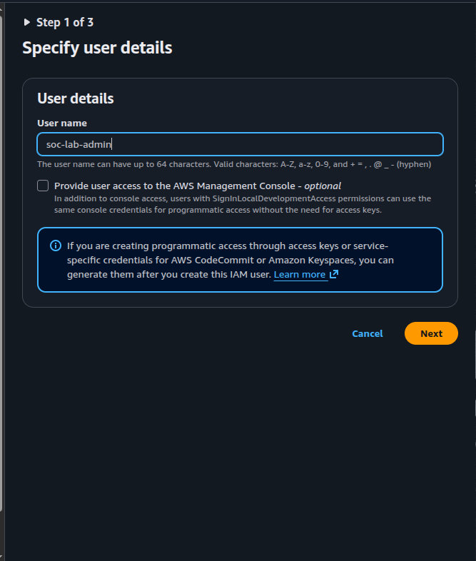

Paso 1 de 3 del asistente **Create user** de IAM. Se define el nombre de usuario **soc-lab-admin**. La casilla "Provide user access to the AWS Management Console" queda sin marcar en este paso, y la consola advierte de que, en caso de necesitar acceso programático (access keys), este se puede generar después de crear el usuario.

---

### 1.2 Asignación de permisos

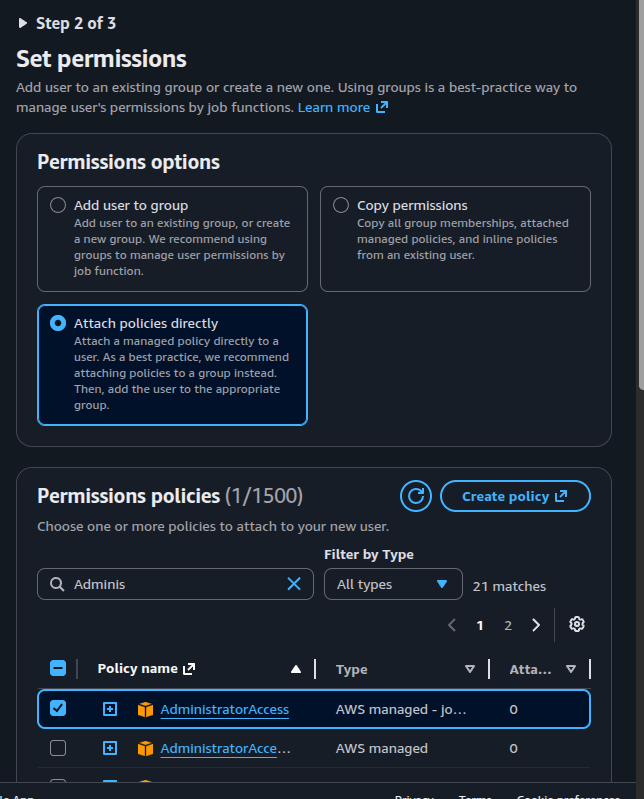

Paso 2 de 3: **"Set permissions"**. Se elige la opción **"Attach policies directly"** (en vez de añadir el usuario a un grupo o copiar permisos de otro usuario) y se selecciona la política administrada **AdministratorAccess** de la lista de políticas disponibles.

---

### 1.3 Acceso a la consola AWS

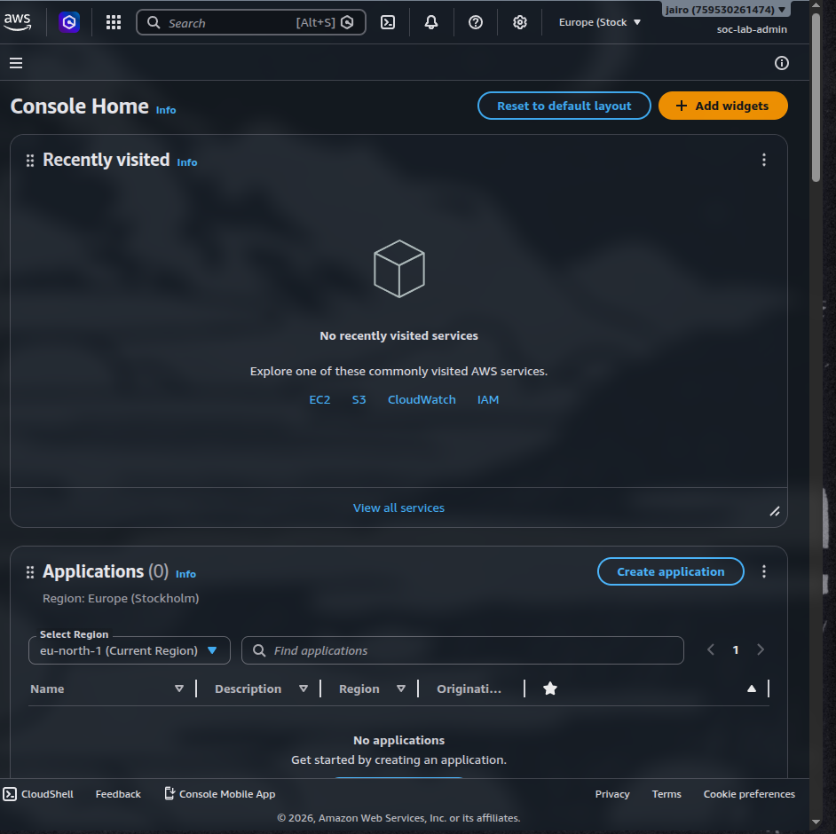

Pantalla **Console Home** tras iniciar sesión como `soc-lab-admin`. La región activa en el momento de esta captura es **Europe (Stockholm) / eu-north-1**. Se muestran accesos directos a los servicios más visitados (EC2, S3, CloudWatch, IAM) y el panel de aplicaciones, sin aplicaciones creadas. El nombre de usuario y el AWS Account ID que aparecían en la esquina superior derecha se han difuminado por tratarse de información sensible.

---

## 2. CloudTrail y notificaciones SNS

### 2.1 Búsqueda del servicio SNS

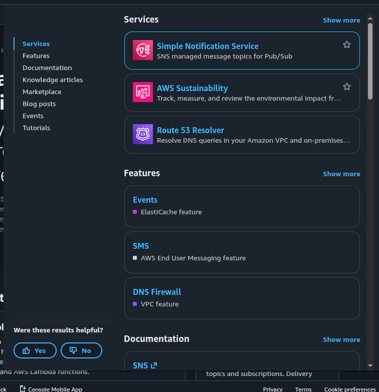

Buscador de la consola de AWS mostrando **Simple Notification Service (SNS)** como resultado principal, descrito como "SNS managed message topics for Pub/Sub", junto a otros resultados relacionados (AWS Sustainability, Route 53 Resolver).

---

### 2.2 Creación del topic soc-security-alerts

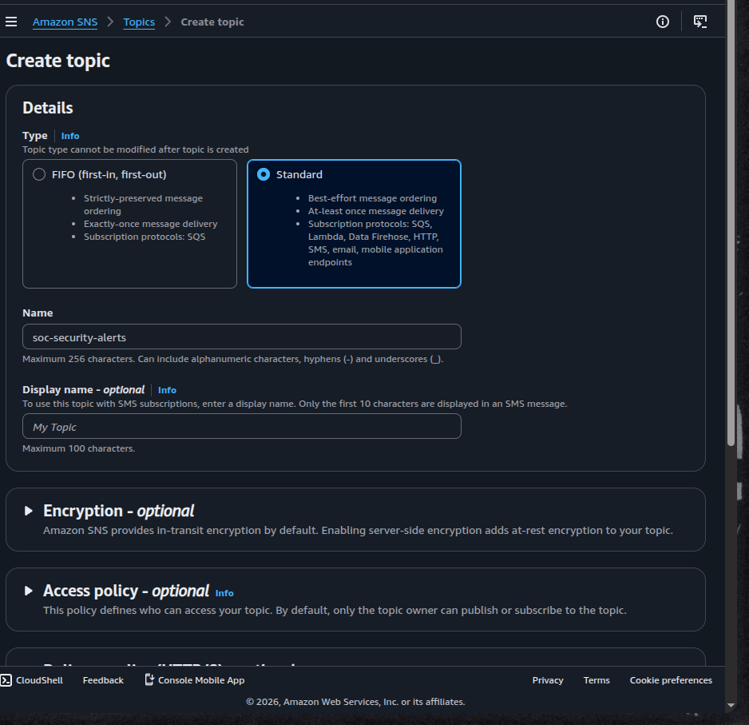

Formulario **"Create topic"** de SNS. Se selecciona el tipo **Standard** (frente a FIFO) y se asigna el nombre **soc-security-alerts**. El campo "Display name" se deja vacío al no usarse suscripciones SMS.

---

### 2.3 Topic creado correctamente

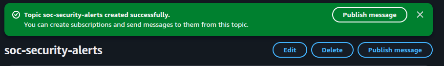

Confirmación: *"Topic soc-security-alerts created successfully. You can create subscriptions and send messages to them from this topic."* Se muestran las opciones **Edit**, **Delete** y **Publish message** sobre el nuevo topic.

---

### 2.4 Suscripción por email

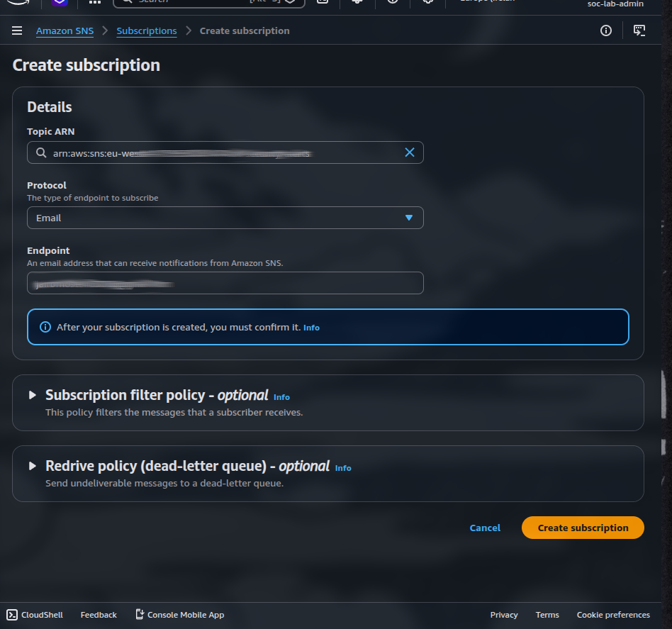

Formulario **"Create subscription"** con el protocolo **Email** seleccionado. Tanto el campo "Topic ARN" como el "Endpoint" (dirección de correo) aparecen difuminados en la propia captura original. La consola advierte de que la suscripción deberá confirmarse tras su creación.

---

### 2.5 Búsqueda del servicio CloudTrail

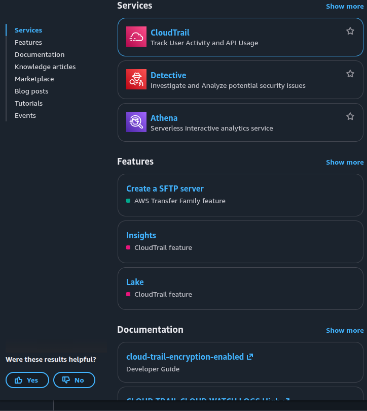

Buscador de la consola mostrando **CloudTrail** ("Track User Activity and API Usage") como resultado principal, junto a **Detective** ("Investigate and Analyze potential security issues") y **Athena**.

---

### 2.6 Creación rápida del trail soc-management-trail

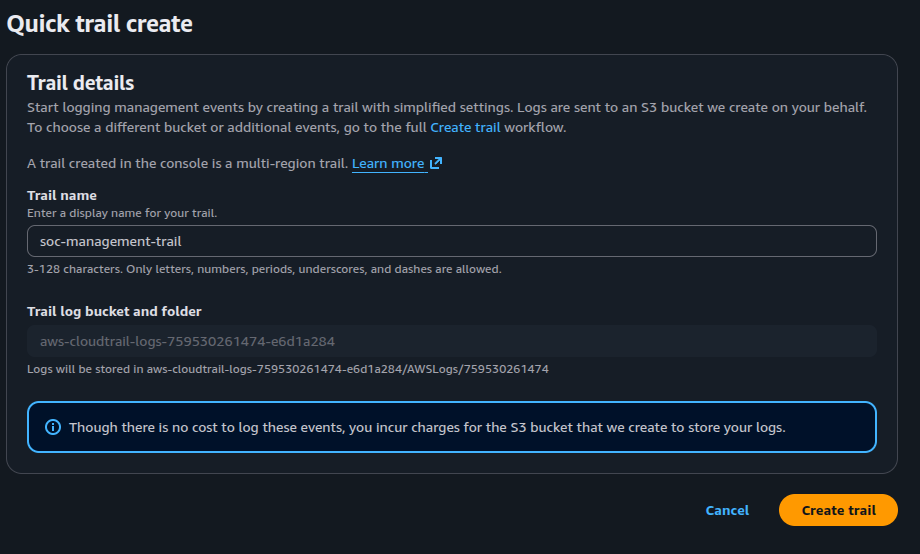

Formulario **"Quick trail create"**: se asigna el nombre **soc-management-trail**. El bucket S3 de destino se genera automáticamente con un nombre único (difuminado en la captura, ya que incorpora el AWS Account ID). La consola advierte de que, aunque el registro de eventos es gratuito, el bucket S3 creado para almacenar los logs sí genera coste.

---

### 2.7 Atributos del trail y bucket S3

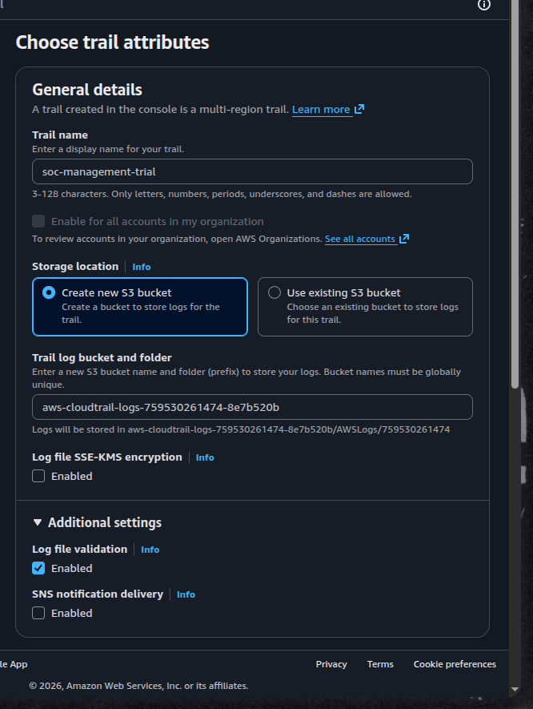

Pantalla **"Choose trail attributes"** con configuración detallada: se crea un **nuevo bucket S3** (frente a usar uno existente), con **Log file validation** activado y **Log file SSE-KMS encryption** y **SNS notification delivery** desactivados en este paso. El nombre del bucket vuelve a aparecer difuminado por incluir el Account ID.

---

### 2.8 Integración con CloudWatch Logs

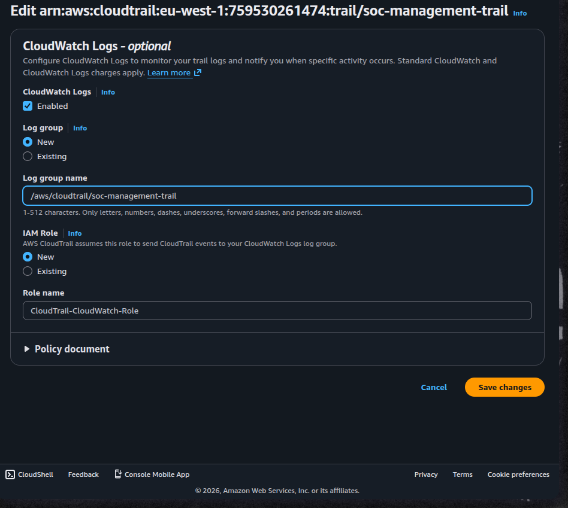

Edición del trail (el ARN de CloudTrail en el título aparece difuminado). Se activa **CloudWatch Logs**, creando un **log group nuevo** llamado `/aws/cloudtrail/soc-management-trail` y un **IAM Role nuevo** llamado `CloudTrail-CloudWatch-Role`, que CloudTrail asumirá para enviar los eventos a ese log group.

---

### 2.9 Trail activo y detalles generales

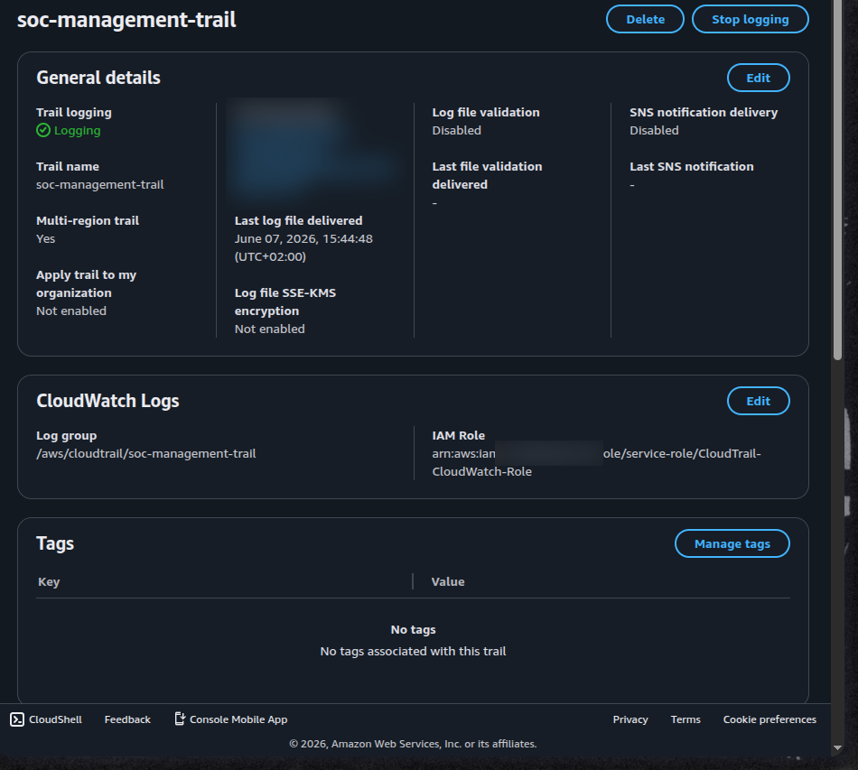

Vista de detalle del trail **soc-management-trail**: estado de logging **activo**, **Multi-region trail: Yes**, **Log file validation: Disabled**, **SNS notification delivery: Disabled** y sin cifrado SSE-KMS. Se muestra el enlace al bucket de logs (difuminado) y, en la sección **CloudWatch Logs**, el log group `/aws/cloudtrail/soc-management-trail` junto al ARN del IAM Role `CloudTrail-CloudWatch-Role` (Account ID difuminado). El trail no tiene tags asociados.

---

## 3. Metric Filters de seguridad en CloudWatch

### 3.1 Filtro IAMUserCreation


Wizard de creación de **metric filter** sobre el log group `/aws/cloudtrail/soc-management-trail`. El banner de éxito confirma que el filtro anterior, **FailedConsoleLogins**, ya había sido creado. Se muestra la revisión del filtro **IAMUserCreation**:

```
{ $.eventName = "CreateUser" }
```

Métrica asignada: nombre **IAMUserCreation**, namespace **SOCLab/Security**, valor de métrica **1**, valor por defecto **0**.

---

### 3.2 Filtro PrivilegeEscalation


Confirmación de creación del filtro **IAMUserCreation** y revisión del siguiente filtro, **PrivilegeEscalation**:

```
{ ($.eventName = PutRolePolicy) || ($.eventName = AttachRolePolicy) || ($.eventName = AttachUserPolicy) }
```

Mismo namespace **SOCLab/Security**, valor 1 / valor por defecto 0.

---

### 3.3 Filtro CloudTrailTampering


Confirmación de creación del filtro **PrivilegeEscalation** y revisión del filtro **CloudTrailTampering**:

```
{ ($.eventName = StopLogging) || ($.eventName = DeleteTrail) || ($.eventName = UpdateTrail) }
```

Este patrón detecta intentos de deshabilitar o alterar el propio trail de CloudTrail.

---

### 3.4 Filtro AccessKeyCreation


Confirmación de creación del filtro **CloudTrailTampering** y revisión del filtro **AccessKeyCreation**:

```
{ $.eventName = "CreateAccessKey" }
```

---

### 3.5 Resumen de metric filters en el log group


Vista general del log group `/aws/cloudtrail/soc-management-trail`: retención de **1 month**, **4.94 MB** almacenados, y el ARN del log group (Account ID difuminado). La pestaña **Metric filters (5)** lista los filtros creados, mostrando entre ellos:

- **FailedConsoleLogins** → `{ ($.eventName = ConsoleLogin) && ($.errorMessage = "Failed authentication") }`
- **IAMUserCreation** → `{ $.eventName = "CreateUser" }`

---

### 3.6 Filtro RootAccountLogin


Confirmación de creación del filtro **AccessKeyCreation** y revisión del último filtro, **RootAccountLogin**:

```
{ $.userIdentity.type = "Root" && $.userIdentity.invokedBy NOT EXISTS && $.eventType != "AwsServiceEvent" }
```

Este patrón detecta inicios de sesión con la cuenta root, excluyendo eventos internos de servicios AWS. El nombre de usuario y el Account ID visibles en la esquina superior derecha se han difuminado.

---

## 4. Alarmas de CloudWatch

Sobre cada uno de los seis metric filters anteriores se crea una alarma de CloudWatch con la misma configuración de acciones: notificar al topic SNS **soc-security-alerts** e invocar la función Lambda **soc-incident-responder** cuando la alarma entra en estado *In alarm*.

### 4.1 Alarma SOC-FailedConsoleLogins-ALARM


Métrica **FailedConsoleLogins** (namespace SOCLab/Security, estadístico **Sum**, periodo **5 minutes**). Condición: umbral estático, disparo cuando el valor es **Greater/Equal (>=) 3**. Acciones configuradas: notificación a **soc-security-alerts** e invocación de la Lambda **soc-incident-responder**. Nombre de la alarma: **SOC-FailedConsoleLogins-ALARM**. Descripción: *"3 o más logins fallidos en 5 minutos — posible ataque de fuerza bruta T1110.001"* (técnica MITRE ATT&CK T1110.001, Brute Force).

---

### 4.2 Alarma SOC-IAMUserCreation-ALARM


Métrica **IAMUserCreation**, estadístico **Sum**, periodo **5 minutes**, umbral **>= 1**. Nombre: **SOC-IAMUserCreation-ALARM**. Descripción: *"Usuario IAM creado — posible backdoor T1136.003"* (técnica MITRE ATT&CK T1136.003, Create Account: Cloud Account).

---

### 4.3 Alarma SOC-PrivilegeEscalation-ALARM


Métrica **PrivilegeEscalation**, estadístico **Sum**, periodo **5 minutes**, umbral **>= 1**. Nombre: **SOC-PrivilegeEscalation-ALARM**. Descripción: *"Modificación de política IAM — posible escalada de privilegios T1098.001"* (técnica MITRE ATT&CK T1098.001, Account Manipulation: Additional Cloud Credentials).

---

### 4.4 Alarma SOC-CloudTrailTampering-ALARM


Métrica **CloudTrailTampering**, estadístico **Sum**, periodo de **1 minute** — el más corto de las seis alarmas, dado que se trata del evento de mayor criticidad al afectar a la propia visibilidad del SOC. Umbral **>= 1**. Nombre: **SOC-CloudTrailTampering-ALARM**. Descripción: *"Intento de deshabilitar CloudTrail — evasión de defensas T1562.008"* (técnica MITRE ATT&CK T1562.008, Impair Defenses: Disable Cloud Logs).

---

### 4.5 Alarma SOC-AccessKeyCreation-ALARM


Métrica **AccessKeyCreation**, estadístico **Average**, periodo **5 minutes**, umbral **>= 1**. Nombre: **SOC-AccessKeyCreation-ALARM**. Descripción: *"Access key creada — posible persistencia T1098.001"* (técnica MITRE ATT&CK T1098.001).

---

### 4.6 Alarma SOC-RootAccountLogin-ALARM


Métrica **RootAccountLogin**, estadístico **Average**, periodo **5 minutes**, umbral **>= 1**. Nombre: **SOC-RootAccountLogin-ALARM**. Descripción: *"Login con cuenta root detectado — T1078.004"* (técnica MITRE ATT&CK T1078.004, Valid Accounts: Cloud Accounts).

---

### 4.7 Resumen de las 6 alarmas activas


Vista **Alarms (6)** con el listado completo: `SOC-RootAccountLogin-ALARM`, `SOC-AccessKeyCreation-ALARM`, `SOC-CloudTrailTampering-ALARM`, `SOC-PrivilegeEscalation-ALARM`, `SOC-IAMUserCreation-ALARM` y `SOC-FailedConsoleLogins-ALARM`, todas con **Actions enabled**. En el momento de esta captura, cinco de las seis muestran estado **OK** y `SOC-RootAccountLogin-ALARM` aparece en **Insufficient data** por no haber recibido aún datos de esa métrica. La columna **Conditions** confirma los umbrales configurados en cada una.

---

## 5. Función Lambda de respuesta a incidentes

### 5.1 Rol de ejecución soc-lambda-responder-role

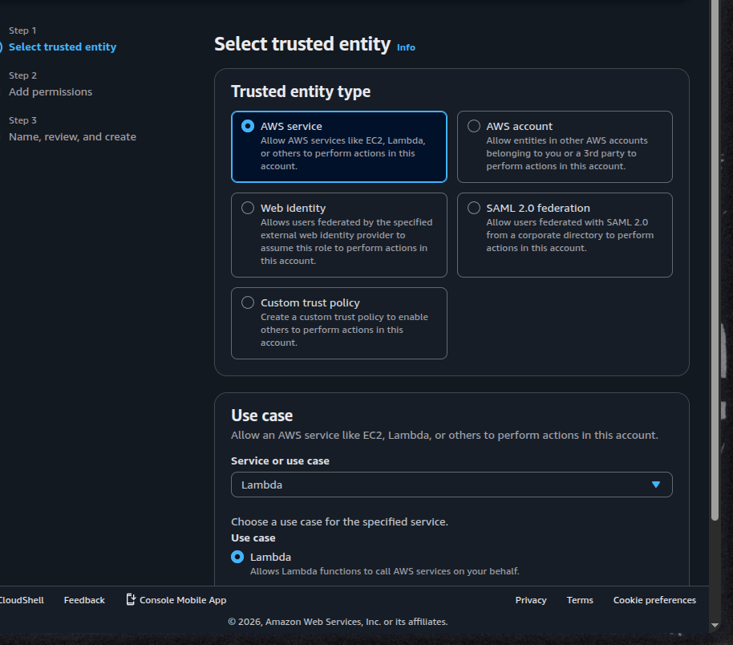

Asistente **"Create role"** de IAM: tipo de entidad de confianza **AWS service**, con el caso de uso **Lambda** seleccionado ("Allows Lambda functions to call AWS services on your behalf").

---

### 5.2 Políticas adjuntas al rol

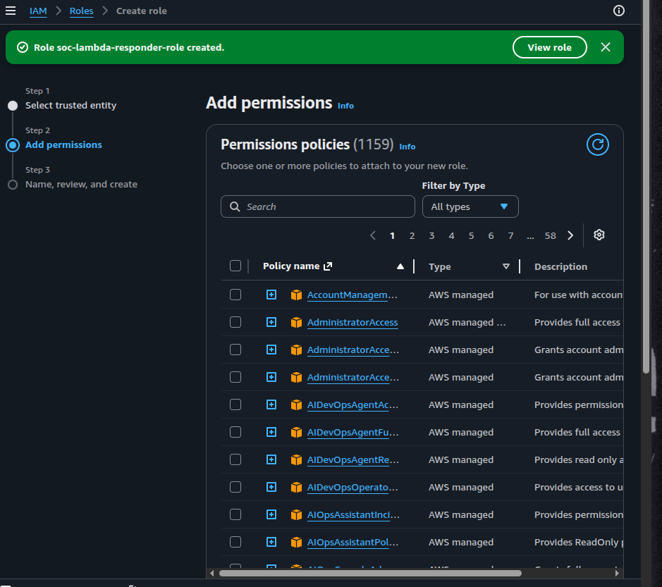

Confirmación *"Role soc-lambda-responder-role created."* en el paso **"Add permissions"**, mostrando el listado completo de políticas administradas de AWS disponibles para adjuntar al nuevo rol (1159 políticas, paginadas).

---

### 5.3 Trust policy y permisos del rol

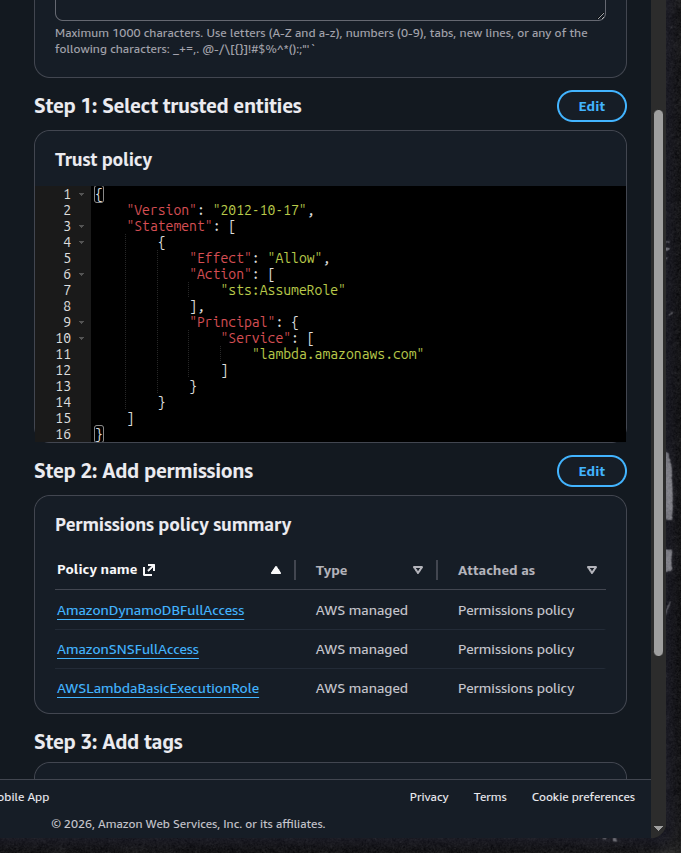

Resumen del rol tras su creación. La **trust policy** permite que el servicio `lambda.amazonaws.com` asuma el rol mediante `sts:AssumeRole`:

```json
{
  "Version": "2012-10-17",
  "Statement": [
    {
      "Effect": "Allow",
      "Action": ["sts:AssumeRole"],
      "Principal": { "Service": ["lambda.amazonaws.com"] }
    }
  ]
}
```

Políticas de permisos adjuntas: **AmazonDynamoDBFullAccess**, **AmazonSNSFullAccess** y **AWSLambdaBasicExecutionRole**, todas de tipo AWS managed.

---

### 5.4 Rol creado en IAM

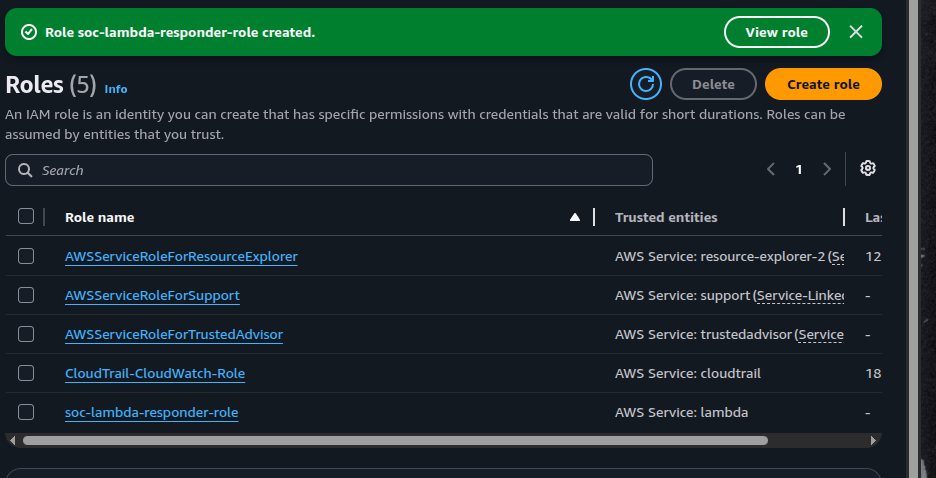

Listado **Roles (5)** de la cuenta, incluyendo `soc-lambda-responder-role` con entidad de confianza **AWS Service: lambda**, junto a otros roles de servicio ya existentes en la cuenta: `AWSServiceRoleForResourceExplorer`, `AWSServiceRoleForSupport`, `AWSServiceRoleForTrustedAdvisor` y `CloudTrail-CloudWatch-Role`.

---

### 5.5 Creación de la función soc-incident-responder

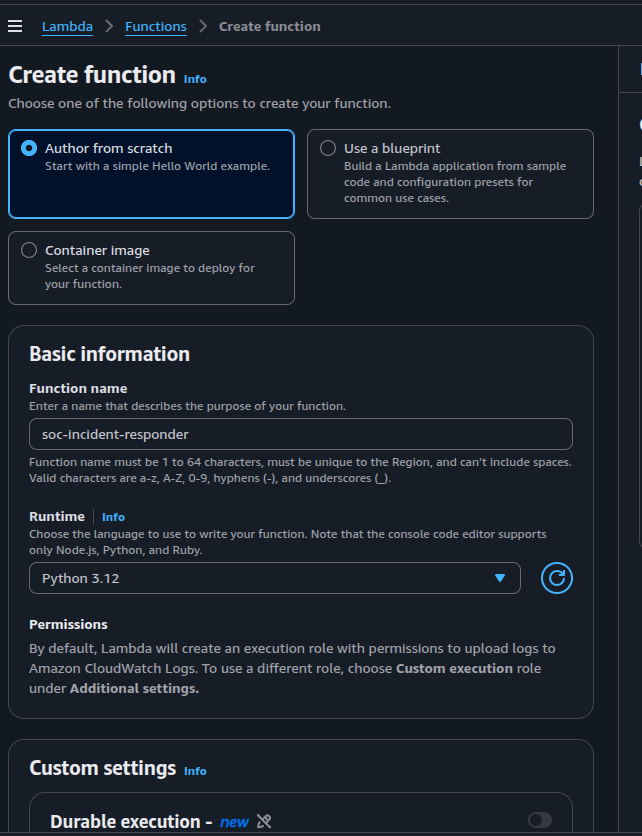

Formulario **"Create function"**: opción **"Author from scratch"**, nombre de función **soc-incident-responder**, runtime **Python 3.12**.

---

### 5.6 Función creada

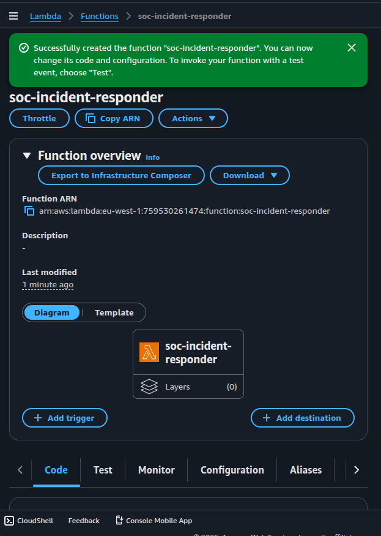

Confirmación *"Successfully created the function 'soc-incident-responder'."* Se muestra el ARN de la función (Account ID difuminado), el diagrama de la Lambda **soc-incident-responder** sin capas ni triggers todavía, y las pestañas **Code / Test / Monitor / Configuration / Aliases**.

---

### 5.7 Código fuente en el editor

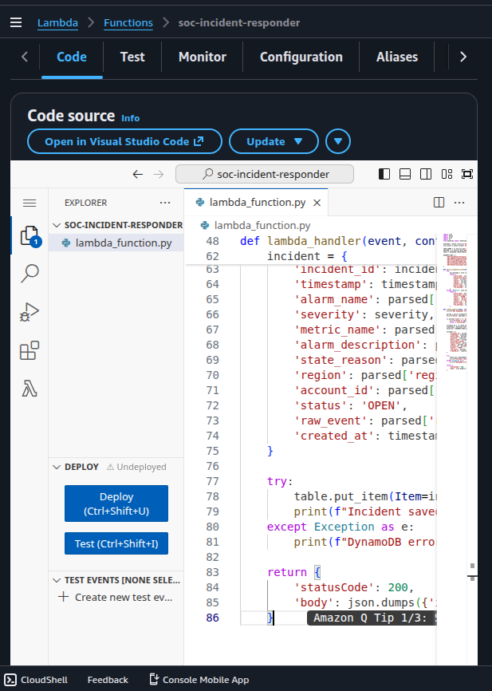

Editor de código integrado de la consola Lambda (con opción "Open in Visual Studio Code") mostrando el archivo `lambda_function.py`. Se aprecia parcialmente la función `lambda_handler`, que construye un diccionario `incident` con campos como `incident_id`, `timestamp`, `alarm_name`, `severity`, `metric_name`, `alarm_description`, `state_reason`, `region`, `account_id`, `status` y `raw_event`, seguido de un bloque `try/except` que ejecuta `table.put_item(...)` y captura errores de DynamoDB, devolviendo finalmente un `statusCode 200` con el resultado en formato JSON.

---

### 5.8 Despliegue del código

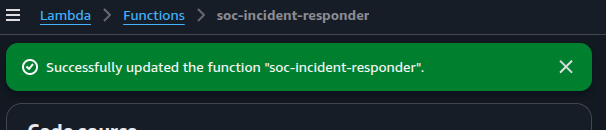

Notificación *"Successfully updated the function 'soc-incident-responder'."* tras desplegar el código con **Deploy**.

---

### 5.9 Variables de entorno

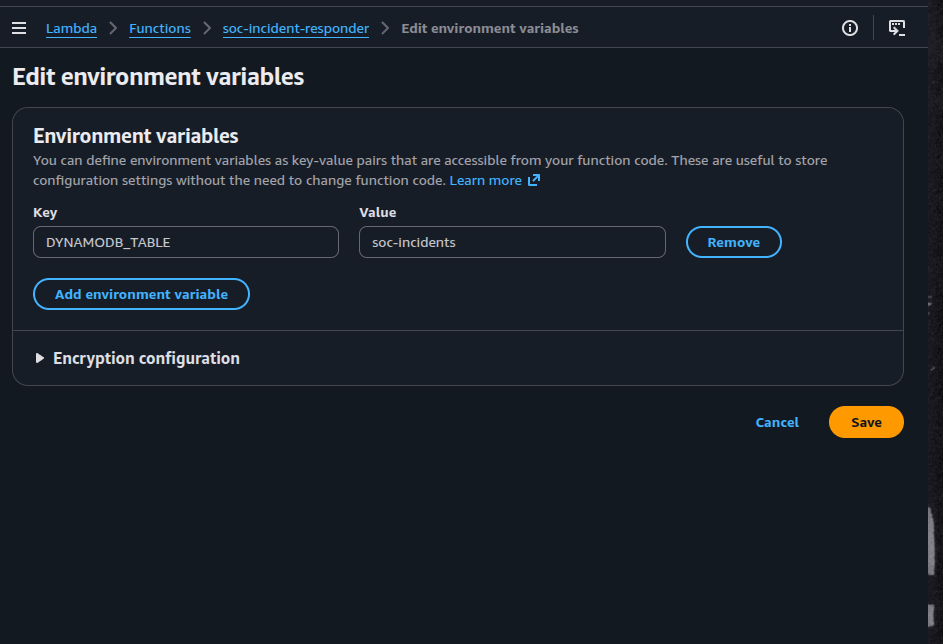

Formulario **"Edit environment variables"**: se define la variable **DYNAMODB_TABLE** con valor **soc-incidents**.

---

### 5.10 Variables de entorno aplicadas

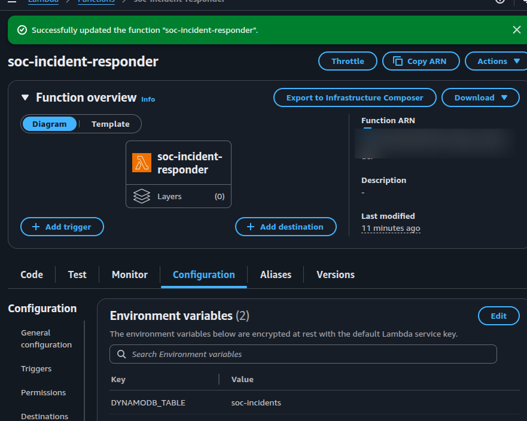

Confirmación de actualización de la función. El ARN completo vuelve a aparecer (Account ID difuminado). La pestaña **Configuration → Environment variables (2)** muestra dos variables definidas, con `DYNAMODB_TABLE = soc-incidents` visible en la tabla (la segunda variable, correspondiente al topic SNS, no se aprecia en el recorte de la captura).

---

### 5.11 Configuración básica de ejecución

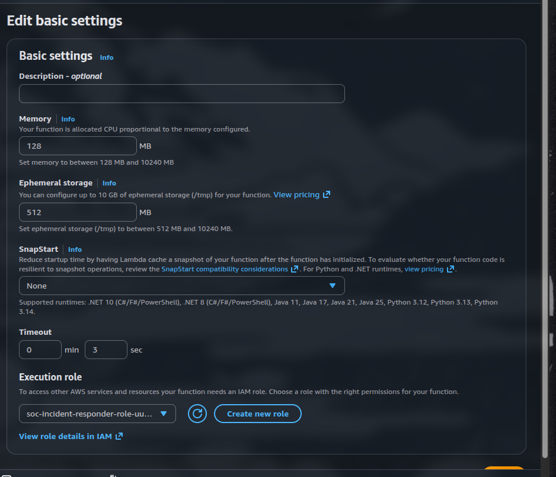

Pantalla **"Edit basic settings"**: **Memory** 128 MB, **Ephemeral storage** 512 MB, **SnapStart** desactivado (**None**), **Timeout** 0 min 3 sec, y **Execution role** `soc-incident-responder-role-uu...` (rol autogenerado por Lambda al crear la función, distinto del rol `soc-lambda-responder-role` creado manualmente en el paso 5.1).

---

### 5.12 Trigger SNS

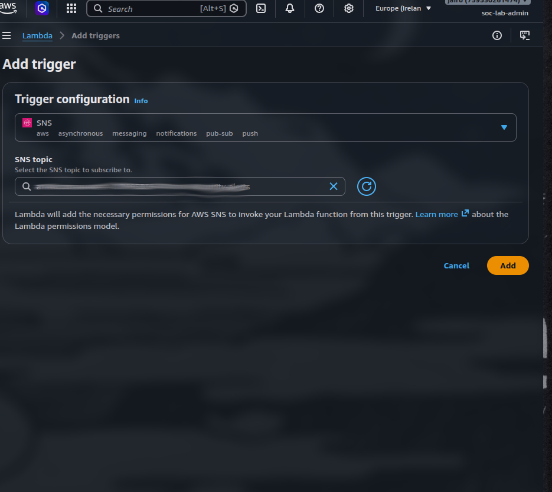

Formulario **"Add trigger"** con el origen **SNS** seleccionado como tipo de trigger. El campo **"SNS topic"** aparece difuminado en la propia captura original. El nombre de usuario y el Account ID de la esquina superior derecha también se han difuminado.

---

### 5.13 Trigger añadido correctamente

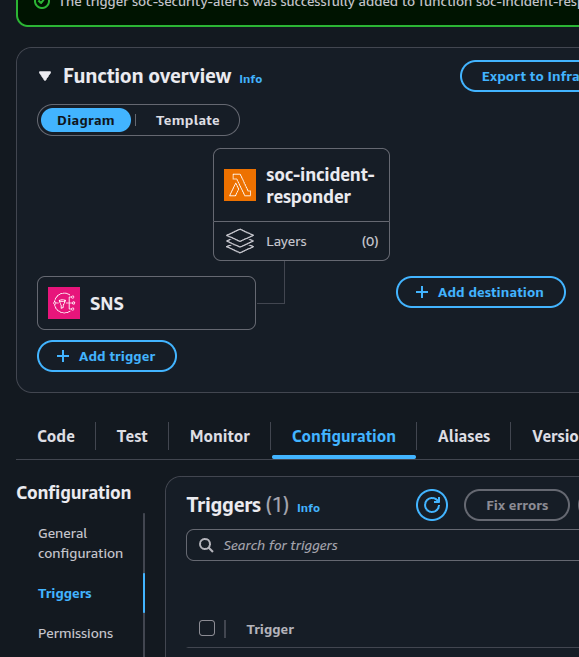

Confirmación *"The trigger soc-security-alerts was successfully added to function soc-incident-responder."* El diagrama de la función ahora muestra el bloque **SNS** conectado a **soc-incident-responder**, y la pestaña **Configuration → Triggers (1)** lista el trigger activo.

---

## 6. Tabla DynamoDB de incidentes

### 6.1 Búsqueda del servicio DynamoDB

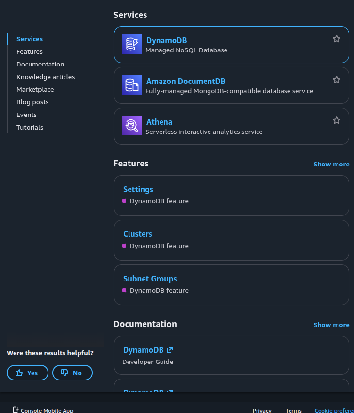

Buscador de la consola mostrando **DynamoDB** ("Managed NoSQL Database") como resultado principal, junto a **Amazon DocumentDB** y **Athena**.

---

### 6.2 Estado inicial sin tablas

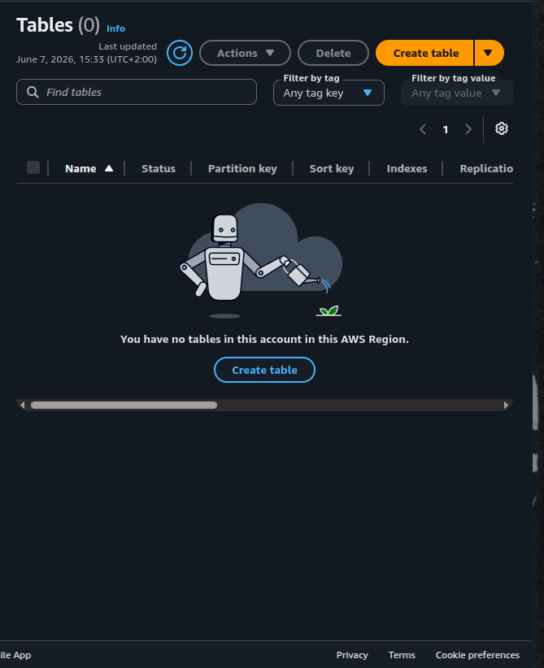

Vista **Tables (0)**: *"You have no tables in this account in this AWS Region"*, con el botón **Create table** para iniciar la creación de la primera tabla.

---

### 6.3 Creación de la tabla soc-incidents

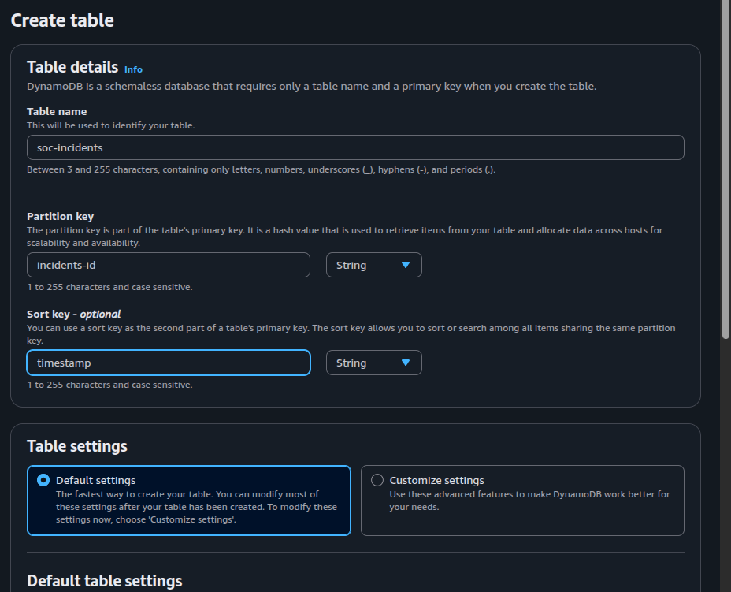

Formulario **"Create table"**: nombre de tabla **soc-incidents**, **partition key** `incidents-id` (tipo String) y **sort key** `timestamp` (tipo String). Configuración de tabla en modo **"Default settings"**.

---

### 6.4 Configuración por defecto

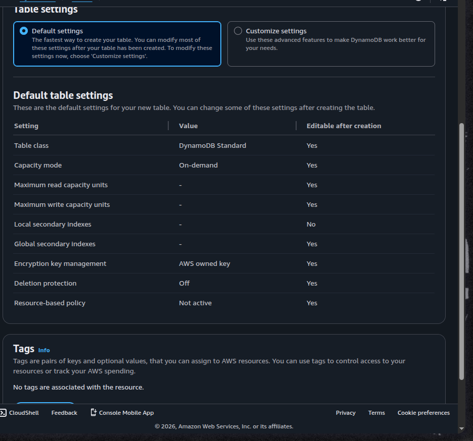

Detalle de los ajustes por defecto aplicados: **Table class** DynamoDB Standard, **Capacity mode** On-demand, sin índices secundarios locales ni globales, **Encryption key management** con AWS owned key, **Deletion protection** desactivada y sin resource-based policy activa.

---

### 6.5 Tabla creada

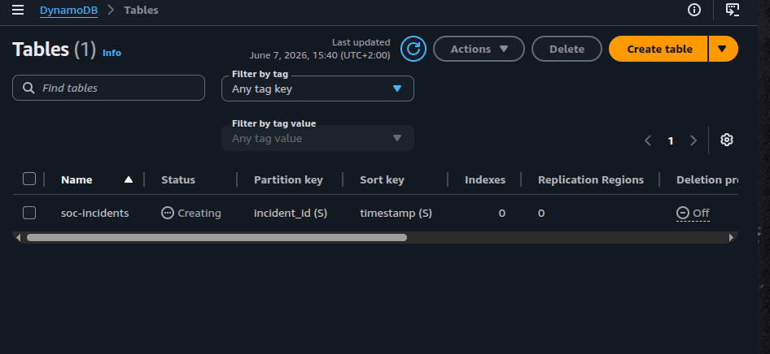

Listado **Tables (1)**: la tabla **soc-incidents** en estado **Creating**, con **partition key** `incident_id (S)` y **sort key** `timestamp (S)` — nombres de campo que coinciden con los usados por la función Lambda `soc-incident-responder` para escribir cada incidente (`incident_id`, `timestamp`, `alarm_name`, `severity`, etc., según se observó en el código fuente de la sección 5.7).

---

## 7. Control de presupuesto

### 7.1 AWS Budgets

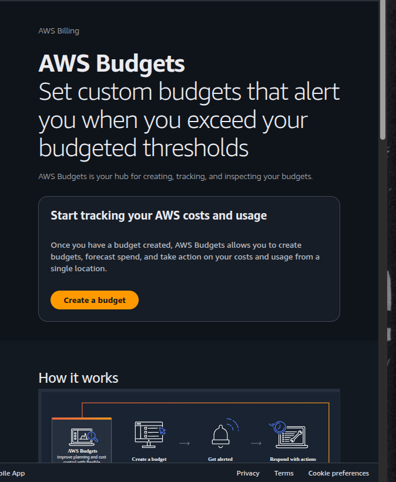

Pantalla de bienvenida de **AWS Budgets**: *"Set custom budgets that alert you when you exceed your budgeted thresholds"*, con el flujo de trabajo **Create a budget → Get alerted → Respond with actions**.

---

### 7.2 Plantilla Zero spend budget

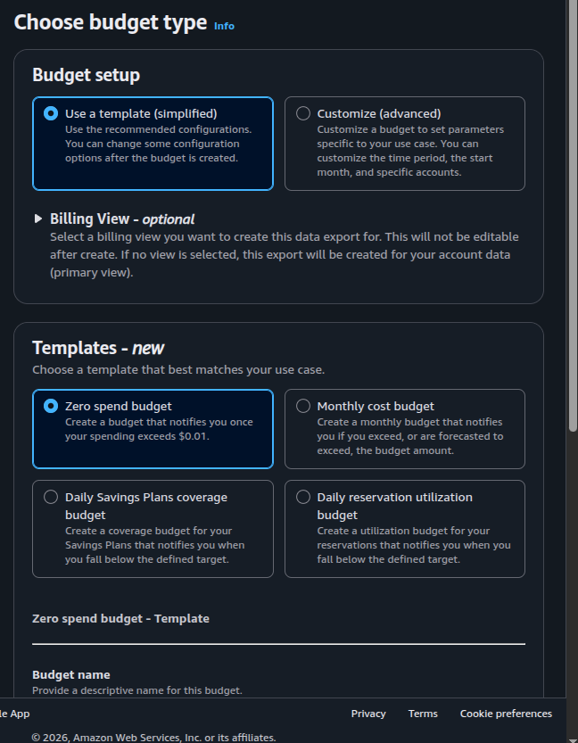

Asistente **"Choose budget type"**: configuración **"Use a template (simplified)"** y plantilla **"Zero spend budget"** seleccionada — crea un presupuesto que notifica en cuanto el gasto supera los **0,01 $**, frente a otras plantillas disponibles (Monthly cost budget, Daily Savings Plans coverage budget, Daily reservation utilization budget).

---

### 7.3 Presupuesto creado

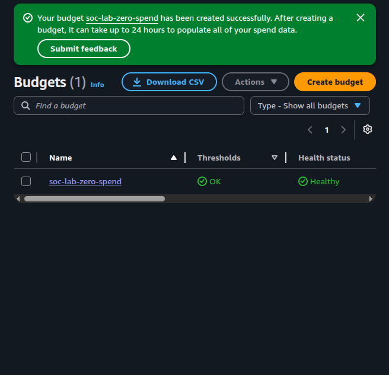

Confirmación *"Your budget soc-lab-zero-spend has been created successfully."* El listado de presupuestos muestra **soc-lab-zero-spend** con **Thresholds: OK** y **Health status: Healthy**.

---

## 8. Simulación de ataque y validación

Para validar el pipeline de detección completo (metric filter → alarma → SNS/Lambda), se simulan manualmente dos de los eventos cubiertos por las alarmas: creación de un usuario IAM y modificación de permisos sobre un rol.

### 8.1 Creación de usuario de prueba

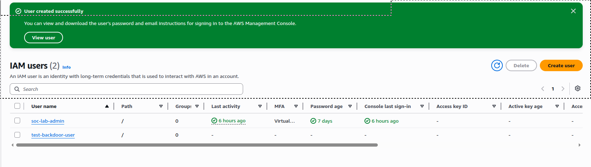

Confirmación *"User created successfully"* tras crear el usuario **test-backdoor-user**, visible junto a `soc-lab-admin` en el listado **IAM users (2)**. Esta acción genera un evento `CreateUser` en CloudTrail, el mismo que captura el metric filter **IAMUserCreation** descrito en la sección 3.1.

---

### 8.2 Alarma IAMUserCreation disparada

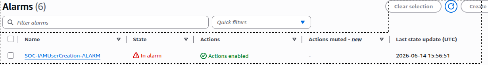

Listado de alarmas **Alarms (6)** mostrando **SOC-IAMUserCreation-ALARM** en estado **"In alarm"** tras la creación del usuario de prueba, con **Actions enabled**, confirmando que el pipeline de detección funciona de extremo a extremo.

---

### 8.3 Adjuntar política al rol Lambda

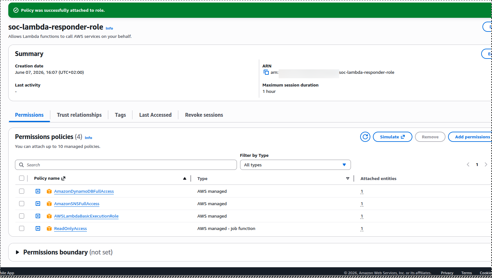

Confirmación *"Policy was successfully attached to role."* sobre **soc-lambda-responder-role**: se añade la política **ReadOnlyAccess** a las tres ya existentes (AmazonDynamoDBFullAccess, AmazonSNSFullAccess, AWSLambdaBasicExecutionRole), pasando de 3 a **4 permissions policies**. El ARN del rol aparece difuminado. Esta acción genera un evento `AttachRolePolicy`, capturado por el metric filter **PrivilegeEscalation** descrito en la sección 3.2.

---

### 8.4 Alarma PrivilegeEscalation disparada

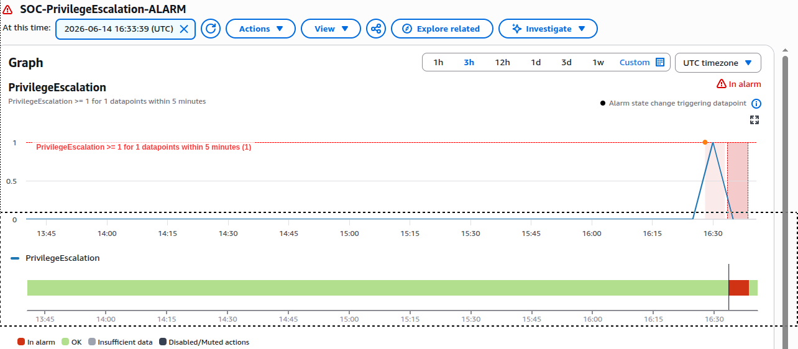

Gráfica de la alarma **SOC-PrivilegeEscalation-ALARM** mostrando el cambio de estado a **"In alarm"** en el instante en que se adjuntó la política al rol: la métrica **PrivilegeEscalation** pasa de 0 a 1 y la barra de estado inferior cambia de verde (OK) a rojo (In alarm), validando la detección del evento simulado.

---

*Documentación generada el 12 de julio de 2026 basada en capturas del despliegue del laboratorio SOC sobre AWS (CloudTrail, CloudWatch, Lambda, DynamoDB, SNS y Budgets, región eu-west-1 / Europe Ireland). El AWS Account ID y el nombre de usuario visibles en las capturas originales han sido difuminados por tratarse de información sensible.*
